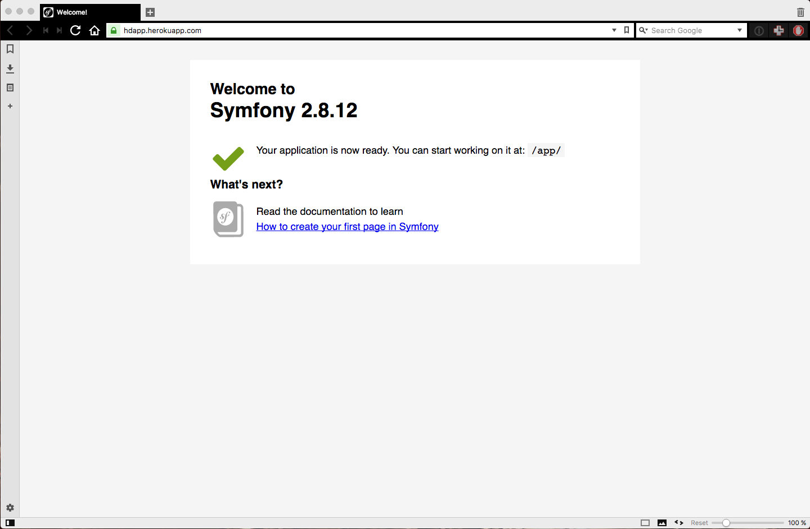

How to  deploy Symfony2 application with DB to Heroku
=====

### Requirements
1. Heroku account - signup at http://heroku.com
2. Install Heroku Command Lin from https://devcenter.heroku.com/articles/heroku-command-line

### Step by step guide

1.  create symfony application
 ```bash
#terminal
$ symfony new hdapp lts
```

2. initialize git repository for your new created application
 ```bash
#terminal
$ git init
$ git add .
$ git commit -m 'initial commit'
```

3.  edit **parameters.yml.dist** file and add
 ```yaml
# app/config/parameters.yml.dist
parameters:
    database_driver: pdo_pgsql
```  

4.   edit **parameters.yml** file and add your own required database driver (in my case) pdo_mysql
 ```yaml
# app/config/parameters.yml
parameters:
    database_driver: pdo_mysql
```  

5.   edit **config.yml** file and add at the begining of doctrine configuration
 ```yaml
# app/config/config.yml
doctrine:
    dbal:
        driver:   "%database_driver%"
```
6.  edit **config_prod.yml** and change *path* from "%kernel.logs_dir%/%kernel.environment%.log" to "php://stderr"
 ```yaml
# app/config/config_prod.yml
monolog:
    # ...
    handlers:
        # ...
        nested:
            # ...
            path: 'php://stderr'
```

7. check if your configuration works by
 ```bash
$ ./app/console doctrine:database:create
```

8.  log in to heroku using your credentials
 ```bash
$ heroku login
```

9. create application on heroku (in my case ***hdapp***)
 ```bash
$ heroku create hdapp
````

10. checking remote github repositories
 ```bash
$ git remote -f
```

  in my case result is

 ```bash
heroku	https://git.heroku.com/hdapp.git (fetch)
heroku	https://git.heroku.com/hdapp.git (push)
origin	https://github.com/mysiar/HOWTO-Symfony2-app-on-Heroku.git (fetch)
origin	https://github.com/mysiar/HOWTO-Symfony2-app-on-Heroku.git (push)
```

11. create procfile
 ```bash
$ echo "web: bin/heroku-php-apache2 web/" > Procfile
$ git add .
$ git commit -m "Procfile for Apache and PHP"
```

12. set heroku environment
 ```bash
$ heroku config:set SYMFONY_ENV=prod

```

13. push application to heroku
 ```bash
$ git push heroku master
```

14. at this moment we have heroku configured for our symfony2 application and application deployed
 ```bash
heroku open
```
 


### Information used
1. https://devcenter.heroku.com/articles/heroku-command-line
2. https://devcenter.heroku.com/articles/git
3. https://symfony.com/doc/2.8/deployment/heroku.html
